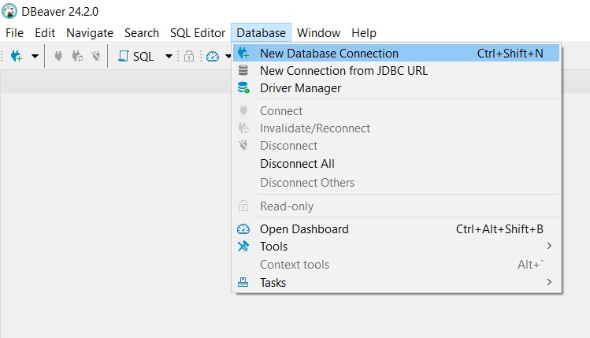
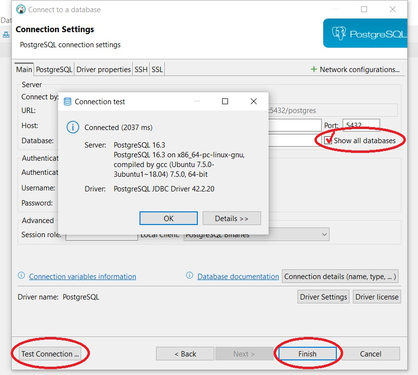
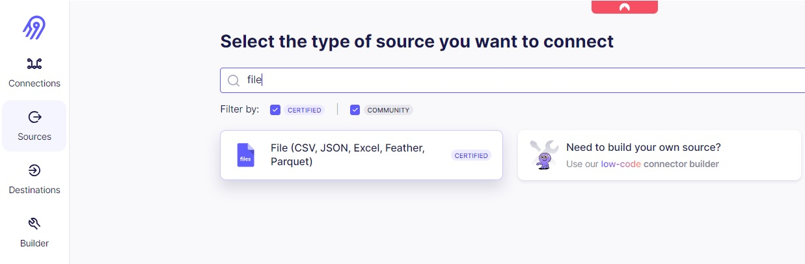
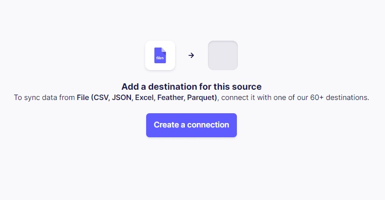
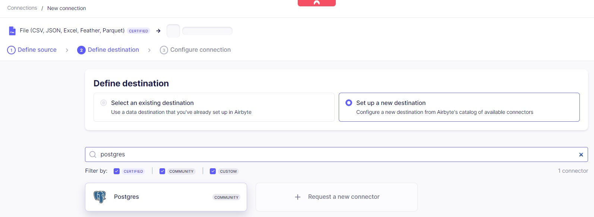
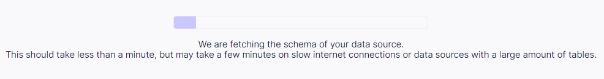
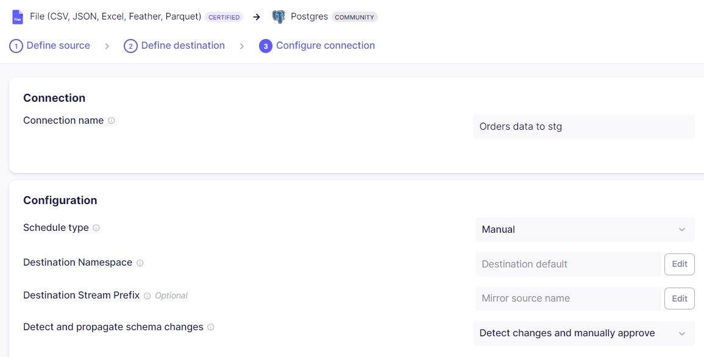
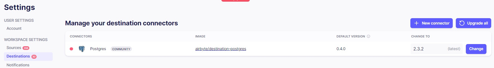
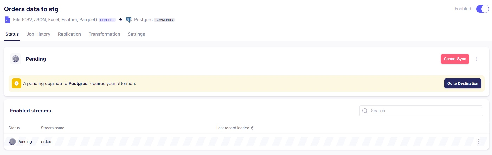
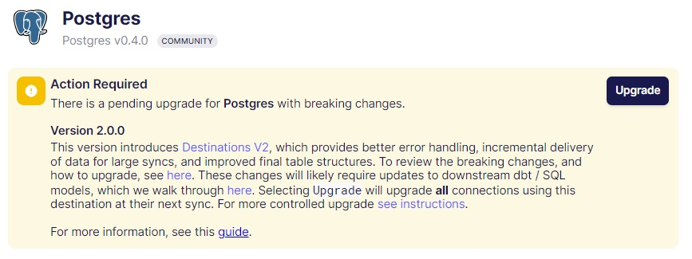

# Dimensional Modeling Project with Azure PostgreSQL, Airbyte, Docker, dbt Core, and Looker

## Overview
This project showcases the application of dimensional modeling on a PostgreSQL database hosted on Azure, utilizing Pentaho Data Integration (PDI) to manage the ETL processes. Dimensional modeling is key to organizing data warehouses for seamless querying and reporting. The work focuses on creating and deploying a star schema to enhance business intelligence and support data analytics, enabling more efficient data retrieval for decision-making.

## Ingesting data into Azure PostgreSQL
  
**Connect to PostgreSQL using DBeaver**

   1. Install the appropriate version of [DBeaver](https://dbeaver.io/download/) for your system.
   2. Open Dbeaver and create **New Database Connection**. 
   
   3. Select **PostgreSQL** from the list of database drivers, then click **Next** to proceed.
   4. Enter the connection details as prompted in the database connection window.
   ```bash
      - Host: your-db-host
      - Port: 5432
      - Database: your-db-name
      - Username: your-db-user
      - Password: your-db-password
   ```
   5. Click **Test Connection** to ensure that the connection details are correct. Click **Finish** to save the connection.

   

Don't forget to check the 'Show all databases' option so that the new database will appear in the Database Navigator's list once it is created.

**Use Airbyte for data ingestion**






You'll need the following information to configure the Postgres destination (the same we used to connect DBeaver):

- **Host**: The host name of the server.
- **Port**: The port number the server is listening on. Defaults to the PostgreSQL™ standard port number (5432).
- **Username**
- **Password**
- **Default Schema Name**: Specify the schema (or several schemas separated by commas) to be set in the search-path.
- **Database**: The database name. The default is to connect to a database with the same name as the user name.



I only changed the Name of the connection and Schedule type to Manual and click Set up connection.





Go to Settings and make sure both Source and Destination you use are upgraded to the latest version.


